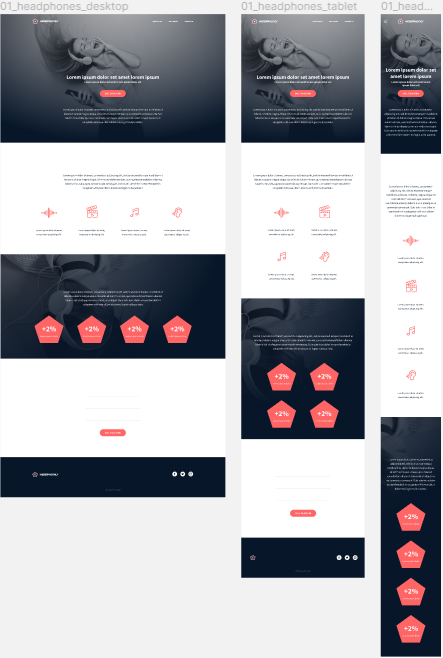

# holberton-headphones

a repository that contains the holberton-headphones project.  In this project, I implemented from scratch, without any library, a web page. I used all HTML/CSS/Accessibility/Responsive design acquired knowledges from previous projects.

Page View from diffrent devices:

  

## Author :black_nib:

* **Yunus Emre TOKYAY** <[yunusemretokyay1](https://github.com/yunusemretokyay1)>

## Acknowledgements :pray:

the work in this project was completed as part of the curriculum for
Holberton School. For more information, visit
[this link](https://www.holbertonschool.com/).

  

